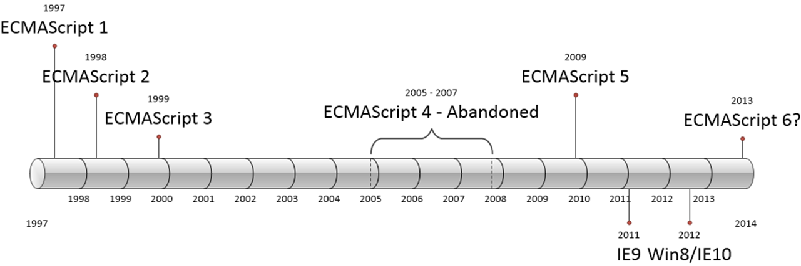

# Javascript 란?

브랜던 아이크가 만든 1995년에 만들었던 스크립트 언어로 HTML, CSS와 함께 구성하는 요소이며 웹 페이지와 상호작용하도록 디자인된 스크립트 언어

- OS위에서 구동하는 브라우저에서 동작하며 코드 실행시 순차적으로 하나씩 실행
- C언어나 Java에서 많은 문법들을 차용했고 그 이외에도 Awk, Perl, Python으로부터도 영향을 받음
- HTML과 CSS로 만들어진 웹페이지를 동적으로 변경해주는 언어
- 인터프리터 언어이기 때문에 Compile 필요없이 HTML 안에 기술 가능
- 멀티-패러다임 언어로 명령형, 함수형, **프로토타입 기반**으로 객체지향 언어로서 사용
- 구글의 Chrome V8 Javascript 엔진으로 빌드된 Javascript 런타임 환경인 Node.js의 등장으로 서버 사이드에서 Front-end 영역은 물론 Back-end 영역까지 아우르는 웹 프로그래밍 언어로 거듭남
- 모바일 웹/앱 개발 분야에서도 가장 중요한 언어로 주목
- Single Page Application 웹 앱이 대중화가 되면서 Angular, React, Vue.js 등 다양한 프레임워크와 라이브러리가 확보

## History

- 1995년 Navigator 2를 위하여 웹페이지에 포함하는 스크립트 언어로 개발되었으며 Livescript로 불리었음

- 1997년 ECMA-262라 불리는 명세가 완성되었으며 상표권 문제로 Livescript에서 ECMAScript로 변경

- 1999년 ECMAScript 3가 공개 되었음

- 10년뒤인 2009년 ECMAScript 5 HTML5와 함께 출현한 표준안(JSON과 Strict Mode가 추가됨)

- 2015년 ECMAScript 6가 공개 되었음(let, const 키워드, Arrow Function, class, Symbol 타입 등이 추가)

  > ES3에서 ES5사이에서 ES4가 받아들이지 않으면서 ES4에 있던 기능들이 ES6에 다 적용됨   



## HTML 속의 Javascript

Javascripts는 HTML 페이지 안에 인라인으로 쓸 수 있고 외부 파일로 분리하여 사용할 수 있음

### 1. `<script>` 요소

- `async` - 외부 스크립트 파일을 불러올 때만 유효하며 브라우저가 가능하면 스크립트를 비동기적으로 실행하는 것을 가리킴
- `charset` - 코드의 문자셋을 지정
- `defer` - 외부 스크립트 파일을 불러올 때 사용하며 문서의 콘텐츠를 완전히 파싱하고 표시할 때까지 스크립트 실행을 지연해도 안전함을 나타냄
- `language` - 원래의 의도는 'Javascript', 'JavaScript1.2', 'VBScript' 처럼 나타낼 목적이였지만 지금은 폐기됨
- `src` - 실행할 코드를 포함한 외부 파일의 위치를 지정
- `type` - language 속성을 대체할 의도로 만들어졌으며 스크립트 언어의 콘텐츠 타입을 지정

### 2. Javascript 선언

Javascript 선언은 브라우저의 기본 설정에 맞추어감

> 대부분의 브라우저는 script 선언의 기본으로 파싱되어있기 때문에 자동으로 script만 선언해도 javascript라고 인식함

```html
// 옛날 하위 브라우저나 호환성을 위한 선언 방식 : HTML5가 되면서 아래의 속성인 language가 없는 것으로 무시되며 사용 X
<script type="text/javascript" language="javascript" src="text.js"></script>

// HTML5 전 선언방식 : type을 명시해줘야 했음
<script type="text/javascript" src="text.js"></script>

// HTML5 선언방식 : type을 명시해주지 않아도 자동으로 HTML5에서 script를 javascript로 인식
<script src="text.js"></script>
```

### 3. Javascript 태그 위치 

Javascript 태그는 일반적으로 `<head>` 요소 안에 넣는 것이 일반적이었는데 이유는 CSS 파일이나 Javascript 파일 같은 외부파일에 대한 참조를 한 곳에 관리하고자 함이었음

```html
<!DOCTYPE html>
<html>
  <head>
    <title>Example HTML Page</title>
  	<script src="text.js"></script>
  </head>
  <body>
    <!-- Page Contents-->
  </body>
</html>
```

>  **하지만 Javascript를 `<head>`에서 불러온다면 자바스크립트 코드를 전부 내려받고, 파싱하고, 해석을 끝낼 때까지 페이지 렌더링이 멈추게 되어 페이지 렌더링 시간이 늦어지기 때문에 `<body>` 요소의 마지막에 페이지 콘텐츠에 사용함**

```html
<!DOCTYPE html>
<html>
  <head>
    <title>Example HTML Page</title>
  </head>
  <body>
    <!-- Page Contents-->
    <script src="text.js"></script>
  </body>
</html>
```


