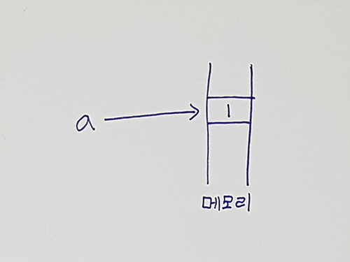
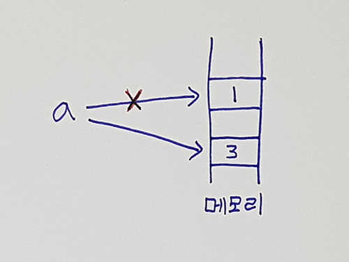
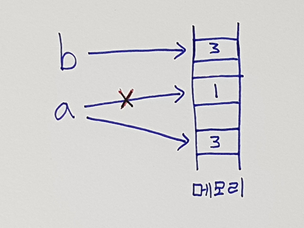
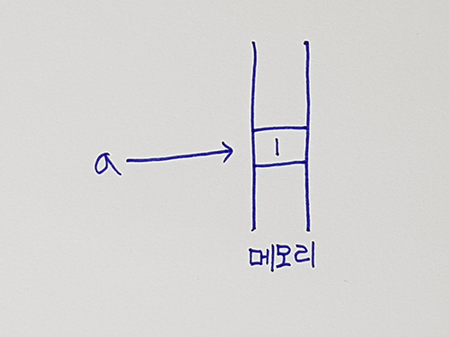
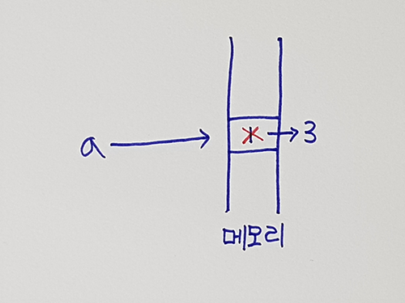
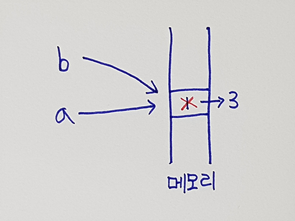

# 자료형 (Data Type)

자료형에는 기본 자료형과 객체형이 있으며 기본자료형에는 `Boolean`, `null`, `undefined`, `Number`, `String`, `Symbol`이 있으며 객체형에는 `Object`가 있음

## 1. 기본 자료형

기본 자료형은 변경 불가능한 값(immutable value)이며 값으로 접근(Pass-by-value)함

> 정적으로 메모리가 정해져있는 STACK 영역에 메모리 할당

예) 아래의 예시를 그림으로 설명

```javascript
var a = 1; // 1번

a = 3;     // 2번

var b = a; // 3번
```

1. ```javascript
   var a = 1;
   ```

   

2. ```javascript
   a = 3;
   ```

   

3. ```javascript
   var b = a;
   ```

   

### 1-1. Boolean

Javascript 내에서 가장 많이 쓰이는 데이터 타입이며 `true`와 `false` 두 가지 값만 가짐

```javascript
var foo = true;
var boo = false;
```

### 1-2. Undefined

Javascript 내에서는 변수를 선언하면 자동적으로 모든 초기값을 `undefined`가 할당

```javascript
var foo; // 값은 undefined

console.log(foo === undefined); // true
```

### 1-3. Null

Null 타입은 값이 하나이고 null은 빈 객체를 가르키므로 변수 정의시 해당 변수가 객체로 사용되어 진다고 하면 null로 초기화 하는 것이 좋음

```javascript
var foo = null;

console.log(typeof(foo)); // object
```

### 여기서 잠깐!! Undefined와 Null의 차이점

```
null과 undefined는 결국 둘다 값이 없음을 나타내는데 둘의 큰 차이점은 등록, 저장 여부이다.

null은 값은 값이지만 값으로서 의미가 없는 특별한 값이 등록되어 있는 것이고, undefined는 등록이 되어있지 않기 때문에 초기화도 정의되지 않는 것이다.

결국 null은 선언, 등록을 하는 키워드이고, undefined는 미리 선언된 전역변수이다.

참고 : http://webclub.tistory.com/1
```

### 1-4. Number

숫자를 표현하는 정수와 실수, 음의 무한대와 양의 무한대를 표현하는 `-Infinity`와 `Infinity`, 숫자가 아닌 값을 나타내는 `NaN`(Not a Number)가 있음

```javascript
var foo = 1;
var boo = 1.3;

console.log(typeof(foo));        // number
console.log(typeof(-Infinity));  // number
console.log(typeof(Infinity));   // number
console.log(typeof(NaN));        // number
```

### 1-5. String

문자열 타입은 Text 데이터를 나타내는데 사용하며 `' '`나 `" "`로 감싸서 표현함

> String의 모든 데이터 타입은 16비트 유니코드 문자의 연속임

```javascript
var foo = "HARIBO";
var boo = 'Chocochip';

var errorFoo = 'Snack"  // error : 따옴표의 짝이 맞지 않음
```

### 여기서 잠깐!! Number Type -> String Type으로 변경하는 방법과 String Type -> Number Type으로 변경하는 방법을 알아보자

#### 1. Number Type을 String Type으로 변경하는 방법

```javascript
var val = 1004;
val = val + '';
// val = val.toString();
// val = String(val);
console.log(typeof val); // string
```

> 첫 번째와 두 번째 방법을 추천

#### 2. String Type을 Number Type으로 변경하는 방법

```javascript
var val = '1004';
val = +val; // "+": 단항 연산자(unary operator)
// val = parseInt(val);
// val = val * 1;
// val = Number(val);
console.log(typeof val); // number
```

> 첫 번째와 두 번째 방법을 추천

### 1-6. Symbol

ES6에서 새롭게 추가된 Type이며 주로 객체의 프로퍼티 키로 사용

> 어플리케이션 전체에서 유일하기 때문에 Symbol 값을 키로 갖는 프로퍼티는 충돌 위험이 없음

```javascript
var key = Symbol('key');
console.log(typeof key); // symbol
```


## 2. 객체형

객체형은 변경 가능한 값(mutable value)이며 참조로 접근(Pass-by-reference)함

> 동적으로 변하는 HEAP 영역에 메모리 할당

예) 아래의 예시를 그림으로 설명

```javascript
var a = 1; // 1번

a = 3;     // 2번

var b = a; // 3번
```

1. ```javascript
   var a = 1;
   ```

   

2. ```javascript
   a = 3;
   ```

   

3. ```javascript
   var b = a;
   ```

   

### 2-1. object

배열, 함수, 정규표현식 등 기본자료형을 제외한 나머지들을 포함

```javascript
var userInfo = {
  name : 'Park',
  number : '13'
};

var user = [];

var foo = function doSomething(){};
```


## 정리

|         기본 자료형         |            객체형             |
| :--------------------: | :------------------------: |
|      데이터를 변경 불가능       |         데이터 변경 가능          |
| 값으로 전달 (Pass by Value) | 참조로 전달 (Pass by reference) |